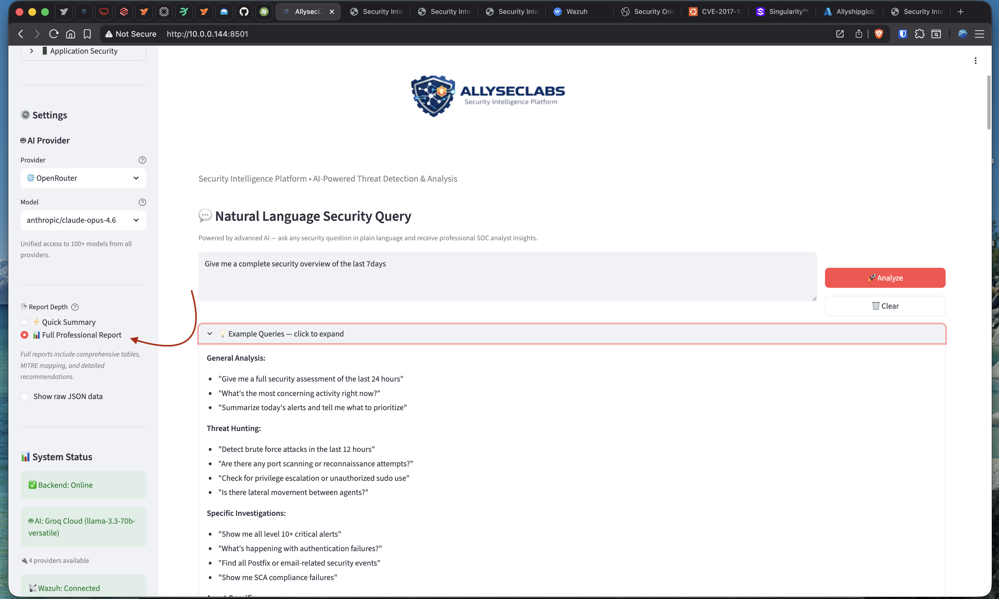
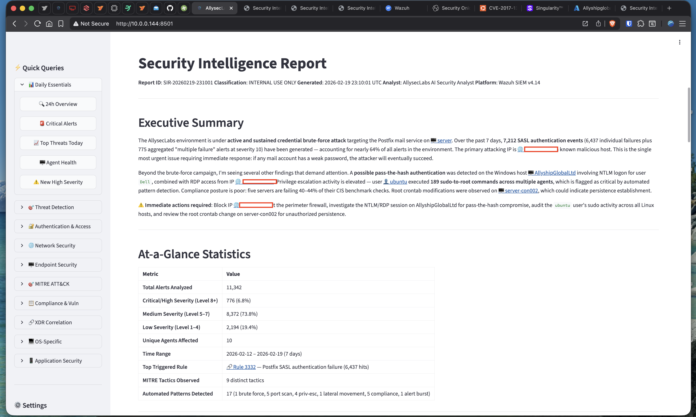
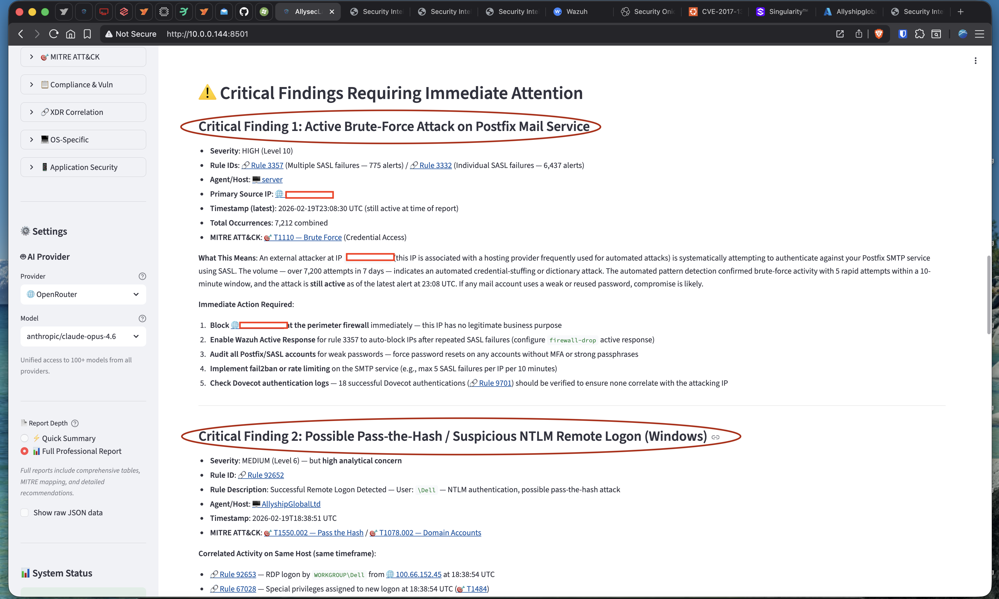
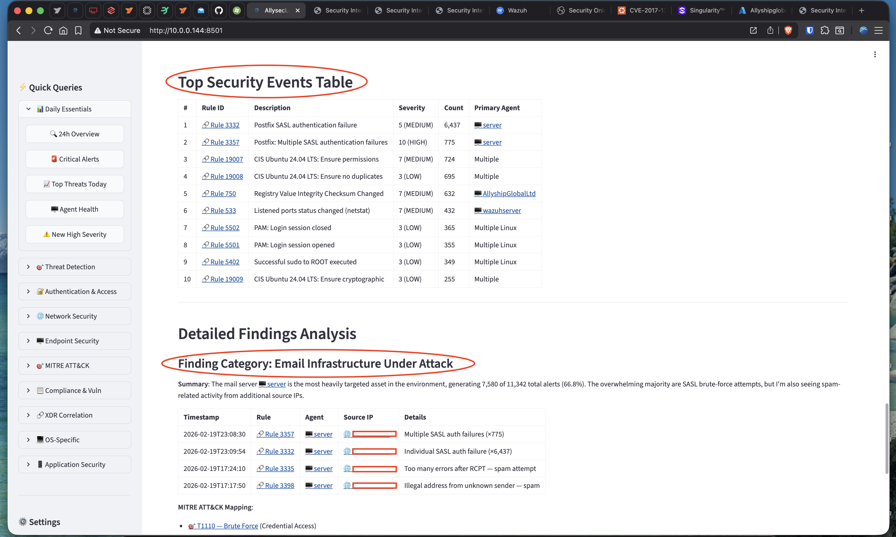
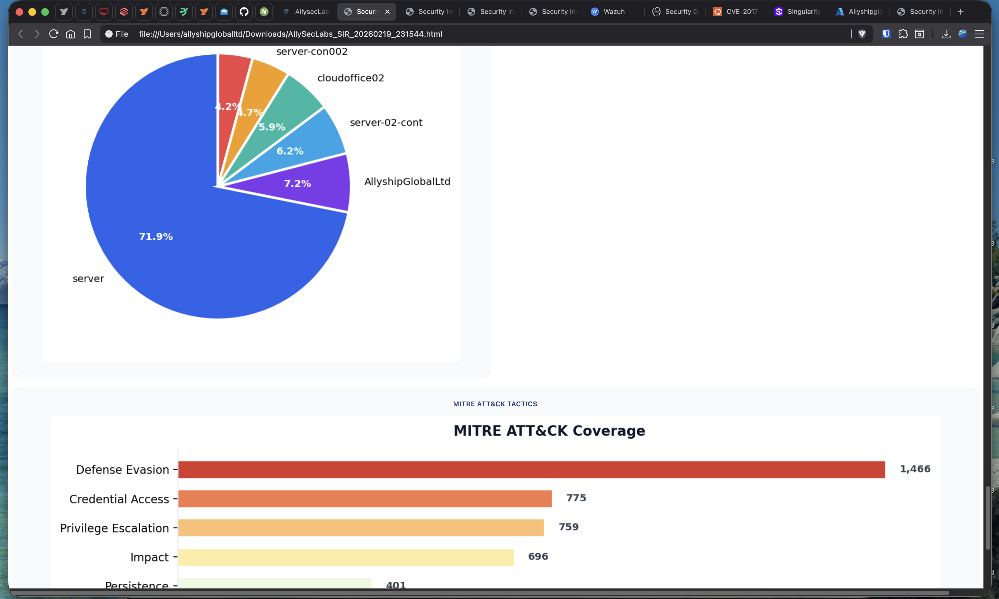

# AllysecLabs Security Intelligence Engine

AI-powered threat detection and analysis for [Wazuh](https://wazuh.com/) SIEM.

Ask security questions in plain English — get professional SOC analyst reports with MITRE ATT&CK mapping, automated pattern detection, and clickable Wazuh dashboard links.

```
"Give me a complete security overview of the last 7 days"
"Detect brute force attacks targeting the mail server"
"Are there indicators of lateral movement between agents?"
"Show all privilege escalation events on Linux systems"
```

---

## Screenshots

### Dashboard — Natural Language Query with Multi-LLM Provider Selector


### AI-Generated Security Intelligence Report


### Critical Findings — Brute Force Detection & Pass-the-Hash Analysis


### Top Security Events Table with Clickable Wazuh Dashboard Links


### Alert Distribution & MITRE ATT&CK Coverage Charts


### Professional Branded HTML Report Export


---

## How It Works

1. **You ask** a natural language question via the web dashboard or API
2. **AI interprets** your question into structured Wazuh search parameters
3. **Alert engine** loads and filters live Wazuh alerts (`alerts.json`)
4. **Pattern detector** identifies brute force, port scans, lateral movement, privilege escalation
5. **AI analyzes** the results as a Tier 2 SOC analyst — MITRE mapping, risk assessment, recommendations
6. **Report generated** with clickable Wazuh dashboard links and exportable HTML/PDF

---

## Features

- **Natural language queries** — ask anything about your security posture
- **Multi-LLM support** — 7 providers, switch from the dashboard:

  | Provider | Type | Models |
  |----------|------|--------|
  | Groq | Cloud | Llama 3.3 70B, Llama 4 Scout, Qwen3 32B |
  | Ollama | Self-hosted | Qwen 2.5, Llama 3.2 (any local model) |
  | OpenRouter | Cloud | 100+ models (GPT-4o, Claude, Gemini, free tier available) |
  | OpenAI | Cloud | GPT-4o, GPT-4o-mini |
  | Anthropic | Cloud | Claude Sonnet 4, Claude Haiku 4 |
  | Google | Cloud | Gemini 2.0 Flash, Gemini 1.5 Pro |
  | HuggingFace | Cloud | Llama 3.3 70B, Qwen 2.5 72B, Mixtral |

- **6 pattern detection algorithms** — brute force, port scanning, privilege escalation, lateral movement, alert bursts, compliance failures
- **MITRE ATT&CK mapping** with clickable links to your Wazuh dashboard
- **Professional reports** — Markdown, branded HTML, and PDF export
- **Incident documentation** — auto-generated IR reports following NIST framework
- **Safety-gated actions** — response broker with dry-run default and audit trail
- **REST API** — fully documented with Swagger UI at `/docs`

---

## Architecture

```
┌──────────────────────────────────────────────────────────┐
│              Streamlit Dashboard (:8501)                  │
│    Threat banners · Charts · AI Analysis · Patterns      │
└───────────────────────┬──────────────────────────────────┘
                        │ HTTP
┌───────────────────────▼──────────────────────────────────┐
│              FastAPI Backend (:8000)                      │
│  /query   — Natural language analysis pipeline           │
│  /status  — Health check (Wazuh + LLM + alerts)         │
│  /docs    — Swagger API documentation                    │
└──┬──────────┬──────────┬──────────┬──────────────────────┘
   │          │          │          │
   ▼          ▼          ▼          ▼
┌──────┐ ┌────────┐ ┌────────┐ ┌───────────┐
│ LLM  │ │ Alert  │ │Pattern │ │  Wazuh    │
│ API  │ │Process.│ │Detect. │ │  Client   │
│(any) │ │        │ │        │ │  (REST)   │
└──────┘ └────────┘ └────────┘ └───────────┘
 7 providers  alerts.json  6 algorithms  Wazuh API
```

---

## Quick Start

### Prerequisites

- Python 3.10+
- Wazuh 4.x (manager with `alerts.json` access)
- At least one LLM API key (Groq free tier recommended to start)

### Install

```bash
git clone https://github.com/robertpreshyl/security-intelligence-engine.git
cd security-intelligence-engine

python3 -m venv venv
source venv/bin/activate
pip install -r requirements.txt
```

### Configure

```bash
cp .env.example .env
nano .env
# Required: WAZUH_API_PASSWORD, GROQ_API_KEY (or any LLM provider key)
```

### Launch

```bash
bash start_dashboard.sh
```

| Service | URL |
|---------|-----|
| Dashboard | http://localhost:8501 |
| API | http://localhost:8000 |
| API Docs | http://localhost:8000/docs |

For production deployment, see the systemd service files in `systemd/`.

---

## Project Structure

```
├── api_server.py              # FastAPI backend — query pipeline & REST API
├── dashboard.py               # Streamlit web dashboard
├── analyze.py                 # CLI analysis tool
├── start_dashboard.sh         # Launch script (API + dashboard)
├── open-firewall.sh           # UFW port opener for 8000/8501
│
├── modules/
│   ├── llm_providers.py       # Multi-LLM provider registry (7 backends)
│   ├── ai_query_engine.py     # NL query interpretation & SOC analysis
│   ├── alert_processor.py     # Alert loading, filtering, stats, MITRE enrichment
│   ├── pattern_detector.py    # 6 automated detection algorithms
│   ├── wazuh_client.py        # Wazuh REST API client (read-only)
│   ├── wazuh_links.py         # Clickable Wazuh dashboard link generator
│   ├── incident_reporter.py   # Incident report generator
│   ├── report_exporter.py     # HTML/PDF export with branding
│   └── action_broker.py       # Safety-gated response actions (dry-run default)
│
├── prompts/
│   ├── master_soc_prompt.py   # SOC analyst prompt engineering & templates
│   └── soc_analyst_system.md  # System prompt specification
│
├── systemd/                   # Production service files
├── docs/                      # Architecture documentation
├── .env.example               # Configuration template
└── requirements.txt           # Python dependencies
```

---

## Configuration

All configuration is via environment variables (`.env` file). See [.env.example](.env.example) for the full reference.

**Required:**
- `WAZUH_API_PASSWORD` — Your Wazuh API password
- At least one LLM API key (`GROQ_API_KEY`, `OPENROUTER_API_KEY`, etc.)

**Optional:**
- `WAZUH_DASHBOARD_URL` — For clickable report links (default: `https://localhost`)
- `OLLAMA_API_URL` — Self-hosted Ollama endpoint
- Additional LLM provider keys — providers auto-appear in the dashboard when configured

---

## License

[AGPL-3.0](LICENSE)

## Security

Found a vulnerability? See [SECURITY.md](SECURITY.md) for responsible disclosure.

## Contributing

See [CONTRIBUTING.md](CONTRIBUTING.md).
